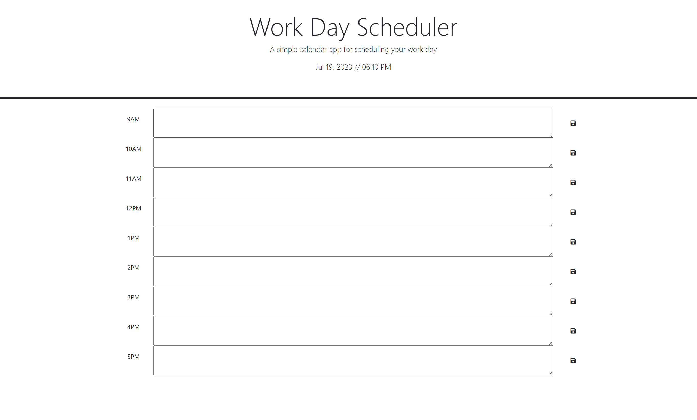

# Work Day Scheduler

## Description
This project was to help keep track of a schedule throughout the work day. It wouldn't be hard to adjust the code to reflect a change in work hours.
The information is stored in the browser so it will carry over into different sessions when reloaded. Color coding helps to keep a quick visual reference as well.

https://britaing.github.io/Work_Day_Scheduler/